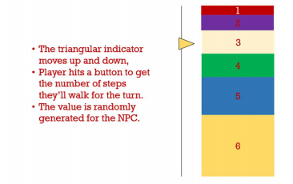

# **Snakes and Kabootars**  
  HU-themed Snakes and Ladders  

#  Group Members:  
- Sudais Yasin  
- Zain Usmani  
- Murtaza Khokhar  

# Project description  
Snakes & Kabootars (tentative title) is an interactive single and multi-player game based on snakes and ladders revolving around Habib University and its culture. At its core it features a map with the regular snakes (as snakes1) and ladders (as magical pigeons/kabootars that shorten distances for you), with a 100-step journey that players compete to finish first. Alongside these there are bunch of new additions to the traditional game to make it more fun:  
- To decide how far to move, instead of rolling a die, the player would have to timely strike on a moving target (see figure below)  
  
- An interactive duel when two players land on the same position (this involves a
similar mechanism to the one above, where players strike the target to get a value
higher than their opponent)  
- A leaderboard to record wins; could involve an implementation of insertion sort  
- A non-player character (NPC/adversary/opponent) that tries to find the shortest route to the finishing block2, given its position. Since every turn will lead to a new position, it may have to recalculate the shortest route per turn and we may have to optimize this.  

The game will of course feature an appropriately themed mouse and keyboard based GUI thateffectively communicates the comedic nature of the game. The map of the game / game-board (of a 100 steps) will be a graph however, we may choose to add the following functionalities to further experiment with our understanding of DSA:  
- Transitions and animations designed using stacks, queues and other data structures  
  - We may also conduct experimental analysis with different GUI aspects in order to see if either one may have significant impacts on game performance  
- A more developed engine / format to the game that enables the game board to be customized easily. This can enable us to easily create randomized gameboards for each playthrough, i.e. randomly-generated levels from the computer for each playthrough.  

# Project Outcome:  
The game is primarily intended to help enable us to successfully build on top of what have learnt through CS102 by implementing it into a functioning program – specifically graphs. The purpose of the game may also become therapeutic or comedic.  

# Libraries Used:  
So far it seems primarily we may only be needing the pygame library; other commonly preinstalled libraries like math, copy and others might also be used. If we are to develop the extra experimental functionalities (e.g., auto-generated gameboard), we may also make use of the random and time libraries.  